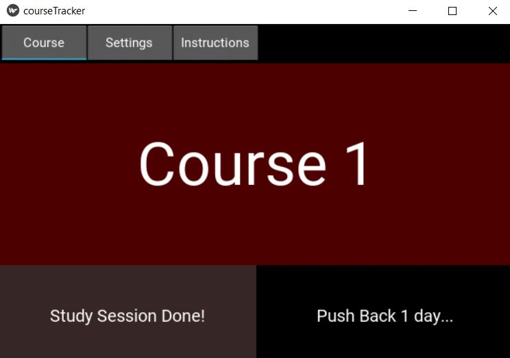

# Course Tracker
Simple application to keep track of your course study.

## Preview


### Prerequisites

[Kivy](https://kivy.org/doc/stable/installation/installation.html)

[Python](https://www.python.org/downloads/)


### Installing

Run:

```
python courseTracker.py
```

## License

Course Tracker is licensed under the GNU GENERAL PUBLIC LICENSE Version 3 - see the LICENSE file for details
