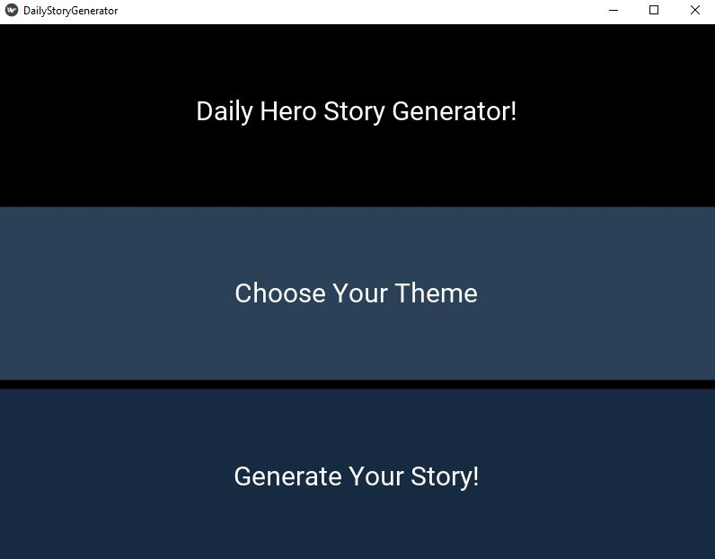
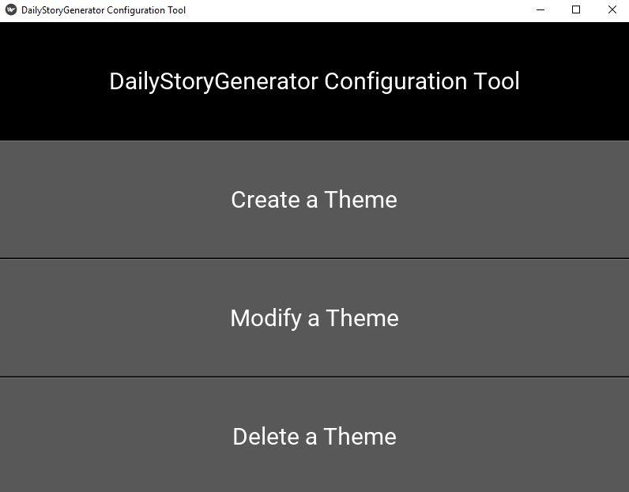

# Daily Story Generator
This application was created in order to generate daily a hero, a villain, an initial story setting and an story objective for role-play.

The user selects a hero and villain pair, and a city, story beginning and story trigger were pulled out randomly to create a daily story to bring about to the day.

There is a very simple example to use, but the force of the application relies in it's customization, where we encourage creativity. 

Enjoy the Daily Story Generator!

## Preview of Application


## Preview of Configuration Tool


### Prerequisites

[Kivy](https://kivy.org/doc/stable/installation/installation.html)

[Python](https://www.python.org/downloads/)


### Installing

Run:

```
python dailystorygenerator
```

To run the configuration tool:
```
python configuration_tool
```


## License

Daily Hero Story Generator is licensed under the GNU GENERAL PUBLIC LICENSE Version 3 - see the LICENSE file for details
