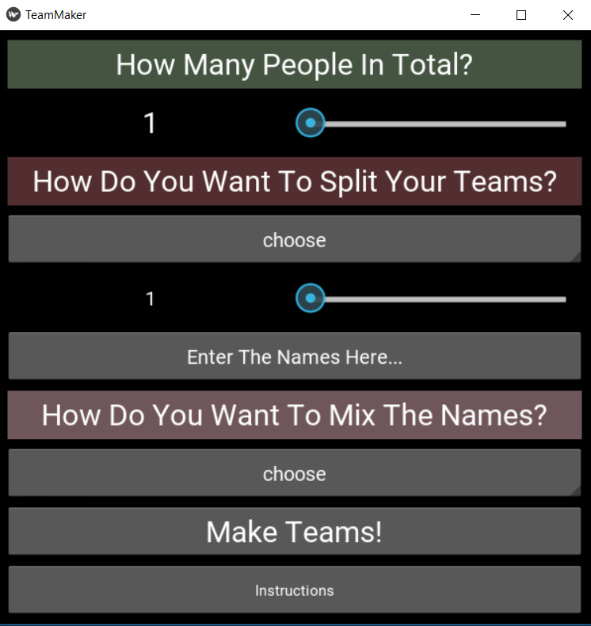

# Team Maker
Team Maker, my first Kivy application, is a simple application to create random teams for school projects, sports events, etc.

## Main Screen Preview


### Prerequisites

[Kivy](https://kivy.org/doc/stable/installation/installation.html)

[Python](https://www.python.org/downloads/)


### Installing

Run:

```
python teammaker
```

## Special Thanks

Thank you at Ryan Pessa for the [ScaledLabel](https://gist.github.com/kived/862db38078170ec0ef83) gist I used in teammakergui.kv.

## License

Team Maker is licensed under the GNU GENERAL PUBLIC LICENSE Version 3 - see the [LICENSE.md](https://github.com/devdess/teammaker/blob/master/LICENSE) file for details
